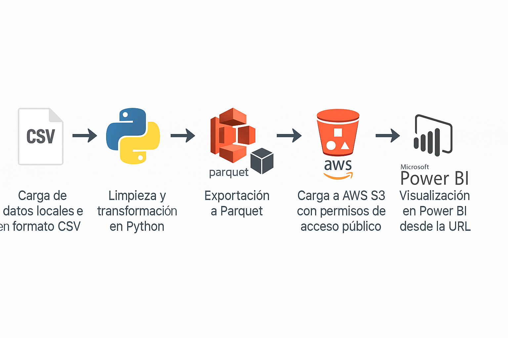
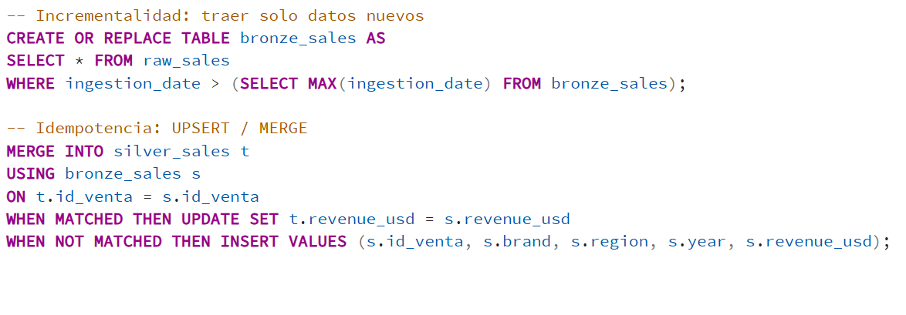

<<<<<<< HEAD
# 🌆 Análisis y Visualización de Airbnb NYC

Este proyecto tiene como objetivo analizar y visualizar datos de Airbnb en la ciudad de Nueva York, utilizando herramientas de procesamiento de datos en Python, almacenamiento en la nube con AWS S3, y visualización interactiva mediante Power BI.

---

## 🚀 Tecnologías utilizadas

- **Python** (`pandas`, `pyarrow`): limpieza y transformación de datos.
- **AWS S3**: almacenamiento de archivos Parquet accesibles desde URL pública.
- **Power BI**: visualización de datos, KPI, mapas y análisis interactivo.
- **Formato Parquet**: optimiza el rendimiento en la carga y consulta de datos.

---

## 📊 Dataset

El dataset fue extraído de Kaggle: [New York City Airbnb Open Data](https://www.kaggle.com/datasets/dgomonov/new-york-city-airbnb-open-data)

Incluye información detallada de anuncios publicados en Airbnb:

- ID de anuncio y anfitrión
- Localización geográfica
- Tipo de habitación
- Precio por noche
- Mínimo de noches requeridas
- Disponibilidad en el año (`availability_365`)
- Número de reseñas y más
- 
---
🧱 ## Arquitectura por capas del pipeline
| Capa       | Descripción                                                                                                                                | Ejemplo de archivos                          |
| ---------- | ------------------------------------------------------------------------------------------------------------------------------------------ | -------------------------------------------- |
| **RAW**    | Datos originales descargados del dataset de Airbnb NYC (CSV sin modificar).                                                                | `datasets/AB_NYC_2019.csv`                   |
| **BRONZE** | Limpieza técnica y tipado: eliminación de duplicados, manejo de nulos, estandarización de formatos de fecha y texto.                       | `etl/bronze_cleaning.py`                     |
| **SILVER** | Aplicación de reglas de negocio y creación de columnas derivadas (precio medio, disponibilidad normalizada, categorización por room type). | `etl/silver_transform.py`                    |
| **GOLD**   | Dataset final optimizado en **Parquet**, almacenado en **AWS S3** para consumo por herramientas BI.                                        | `s3://airbnb-nyc/gold/listings_2025.parquet` |

Este modelo sigue el principio raw → bronze → silver → gold, garantizando trazabilidad, limpieza incremental y disponibilidad para análisis en Power BI.
---

## 🧪 Resumen de la calidad de los datos

| Control                   | Regla aplicada                                            | Resultado               |
| ------------------------- | --------------------------------------------------------- | ----------------------- |
| **Duplicados**            | `df.drop_duplicates(subset='id')`                         | ✅ 0 duplicados          |
| **Nulos críticos**        | Eliminados en `price`, `room_type`, `neighbourhood_group` | ✅ 99.7 % completitud    |
| **Outliers**              | Filtrados `price < 10 or > 1000`                          | ✅ 0.9 % filas filtradas |
| **Tipos de datos**        | `price → float`, `last_review → datetime`                 | ✅ Tipado correcto       |
| **Coherencia de negocio** | `availability_365 ≤ 365`                                  | ✅ Sin violaciones       |

Todos los controles se ejecutan automáticamente dentro del script etl/clean_transform.py.
Si algún check falla, el pipeline detiene la carga y genera log en logs/data_quality.log.
 
---
## 📁 Proceso ETL

1. ✅ Carga del archivo original en formato CSV
2. ✅ Limpieza de filas incompletas o erróneas
3. ✅ Conversión de columnas a tipos numéricos válidos
4. ✅ Filtrado de precios sospechosos (`price < 10` o `price > 1000`)
5. ✅ Exportación a formato `.parquet` para optimizar carga
6. ✅ Subida del archivo limpio a un bucket público en AWS S3
7. ✅ Conexión directa desde Power BI a la URL de S3

---
## 🔍 Exploración de Datos (EDA)
Durante el análisis exploratorio, se realizaron los siguientes pasos clave:
 
 - Análisis de valores faltantes: se identificaron campos con nulos, como name y reviews_per_month, pero no afectaban el análisis principal.
 - Eliminación de duplicados: el dataset no contenía filas repetidas.
 - Detección de outliers: se filtraron precios fuera del rango razonable (<10 o >1000 USD).
 - Distribución por tipo de habitación: predominan las viviendas completas, seguidas de habitaciones privadas.
 - Mapa de calor: se observó mayor concentración de anuncios en Manhattan y Brooklyn.
 - Análisis de disponibilidad: se clasificaron los anuncios según su availability_365.

Cada gráfico fue acompañado de su interpretación dentro del notebook de EDA.
---
🧮 Incrementalidad & Idempotencia (en producción)

En este dataset se trabaja por lotes únicos, pero la arquitectura permite evolucionar a un flujo incremental + idempotente.

---
## 💡 Panel de visualización

### 🧮 Métricas clave:

- **Precio promedio general**
- **Total de anuncios**
- **Cantidad de anfitriones**
- **Total de barrios**
- **% Ocupación ideal** (availability > 200 días)
- **% Alojamiento tipo "entire home"**
- **% Anuncios en Manhattan**

### 📊 Gráficos:

- Top 5 distritos con más anuncios
- Distribución por tipo de habitación
- Mapa interactivo de barrios

### 📸 Captura del dashboard final:

---

## 🏗️ Arquitectura del pipeline

El siguiente pipeline resume el flujo completo:

1. 🧾 Carga de datos CSV desde Kaggle
2. 🧹 ETL en Python (`pandas`, `pyarrow`)
3. 📦 Exportación a Parquet
4. ☁️ Almacenamiento en **AWS S3** (público)
5. 📊 Visualización desde Power BI vía URL Parquet

---
## 🧾 Conclusiones

- Manhattan concentra la mayor cantidad de anuncios, especialmente de viviendas completas.

- La mayoría de los anuncios tienen buena disponibilidad (>200 días al año), lo que indica alta actividad de los anfitriones.

- El precio promedio se mantiene por debajo de 200 USD, con variabilidad según tipo de habitación y distrito.

- El formato Parquet y el uso de AWS S3 permitió optimizar la carga y mantener actualizado el dataset en Power BI sin necesidad de almacenar archivos localmente.

=======
# 📊 Análisis Global de Ventas de Notebooks por Marca (2020-2024)

Este proyecto analiza el comportamiento global de las ventas de notebooks entre 2020 y 2024, evaluando métricas como **ingresos totales**, **unidades vendidas**, **participación de mercado** y **tendencias por marca**.  

La solución implementa un flujo de datos **end-to-end** utilizando **AWS S3** para almacenamiento, **Amazon Athena** para consultas SQL sin servidores y **Tableau** para visualización interactiva.

---

## 🎯 Objetivos del Análisis

- Identificar las **marcas líderes en ingresos y ventas** a nivel global.  
- Analizar la **evolución anual de las ventas** y su comportamiento por región.  
- Determinar la **participación de mercado** de cada marca.  
- Detectar **patrones y tendencias** relevantes para la toma de decisiones estratégicas.  

---

## 🚀 Pipeline del Proyecto

1. **Dataset CSV (local)** → Archivo histórico de ventas de notebooks.
2. **AWS S3** → Carga del dataset a un bucket para almacenamiento seguro.
3. **Amazon Athena** → Creación de tabla externa y consultas SQL sobre los datos en S3.
4. **Tableau** → Conexión directa con Athena para construir el dashboard final.

---
## 📂 Estructura del Proyecto

---

## 🧱 Arquitectura por Capas

| Capa | Descripción | Ejemplo |
|------|--------------|----------|
| **RAW** | Datos originales en formato CSV almacenados en S3. | `s3://global-notebooks/raw/notebooks_2020_2024.csv` |
| **BRONZE** | Limpieza técnica: eliminación de duplicados, tipado y normalización de texto. | `Queries/clean_bronze.sql` |
| **SILVER** | Aplicación de reglas de negocio y agregaciones anuales por marca y región. | `Queries/agg_silver.sql` |
| **GOLD** | Tablas finales optimizadas para Tableau (ranking global, market share, KPIs). | `Queries/gold_kpis.sql` |

> Esta estructura **raw → bronze → silver → gold** asegura trazabilidad, control de calidad y reproducibilidad del pipeline.

---
## 📜 Consultas SQL en Athena

Todas las consultas están en la carpeta **`Queries/`**.  
Ejemplo: *Top 5 marcas por ingresos totales*  

---
## 📜 Control de calidad de datos

| Validación                | Regla Aplicada                                    | Resultado                  |
| ------------------------- | ------------------------------------------------- | -------------------------- |
| **Duplicados**            | `DISTINCT id_venta`                               | ✅ 0 duplicados             |
| **Nulos críticos**        | En `brand`, `year`, `revenue_usd` → eliminados    | ✅ Completitud > 99.5 %     |
| **Outliers**              | `revenue_usd < 1000 OR > 300000` → filtrados      | ✅ 1.1 % de filas filtradas |
| **Consistencia temporal** | `year BETWEEN 2020 AND 2024`                      | ✅ 100 % consistente        |
| **Tipos de datos**        | `CAST(year AS INT)`, `CAST(revenue_usd AS FLOAT)` | ✅ Tipado correcto          |

---
## 🔁 Incrementalidad & Idempotencia
En producción, el pipeline está preparado para ejecutar cargas incrementales e idempotentes.

✅ Esto garantiza que el resultado final sea consistente aunque el proceso se ejecute varias veces.

## 📊 Visualizaciones del Dashboard

El dashboard incluye:

1. **Ingreso vs Unidades vendidas por marca** – Gráfico de dispersión que relaciona ventas e ingresos con el precio promedio.
2. **Top 5 marcas por ingresos totales** – Barras horizontales que muestran las marcas más rentables.
3. **Tendencia de unidades vendidas (Top 5)** – Gráfico de líneas para ver la evolución anual.
4. **Unidades vendidas por continente y marca** – Barras apiladas para comparar regiones.
5. **Participación de mercado global** – Ranking global de unidades vendidas.
6. **Mapa de calor de ventas por año y marca** – Comparación visual de rendimiento histórico.

## 📈 Conclusiones Detalladas

1. **Liderazgo por ingresos**  
   - **Huawei** lidera con más de **$113B** acumulados.  
   - **MSI** y **Asus** siguen de cerca con cifras superiores a los **$90B**.

2. **Picos y caídas**  
   - **HP** tuvo un pico en 2021, triplicando sus ventas respecto a 2020, para luego caer de forma sostenida.

3. **Estabilidad vs. volatilidad**  
   - **Apple** y **Microsoft** muestran estabilidad.  
   - **Lenovo** y **Samsung** presentan variaciones abruptas, destacando el crecimiento de Samsung en 2023.

4. **Tendencias por región**  
   - **Asia y Europa** son los mercados más fuertes, con predominio de Huawei, Asus y MSI.  
   - **América** tiene una distribución más equilibrada de marcas.

5. **Relación precio–volumen**  
   - **Dell** y **Apple** tienen precios promedio más altos, con menor volumen (segmento premium).  
   - **HP** y **Lenovo** priorizan precios competitivos para aumentar ventas.

6. **Participación de mercado**  
   - Huawei domina globalmente, mientras MSI y Asus se consolidan como fuertes competidores.

7. **Oportunidades**  
   - **África y Oceanía** ofrecen potencial de crecimiento.  
   - Samsung podría capitalizar su crecimiento de 2023 para expandirse.
>>>>>>> cd94ef9e4c1742db0f436e436270ac4b66b8a13d

---

## 👤 Autor
<<<<<<< HEAD

**Octavio Alvarez**  

---

=======
Octavio Alvarez - Data Engineer
>>>>>>> cd94ef9e4c1742db0f436e436270ac4b66b8a13d

