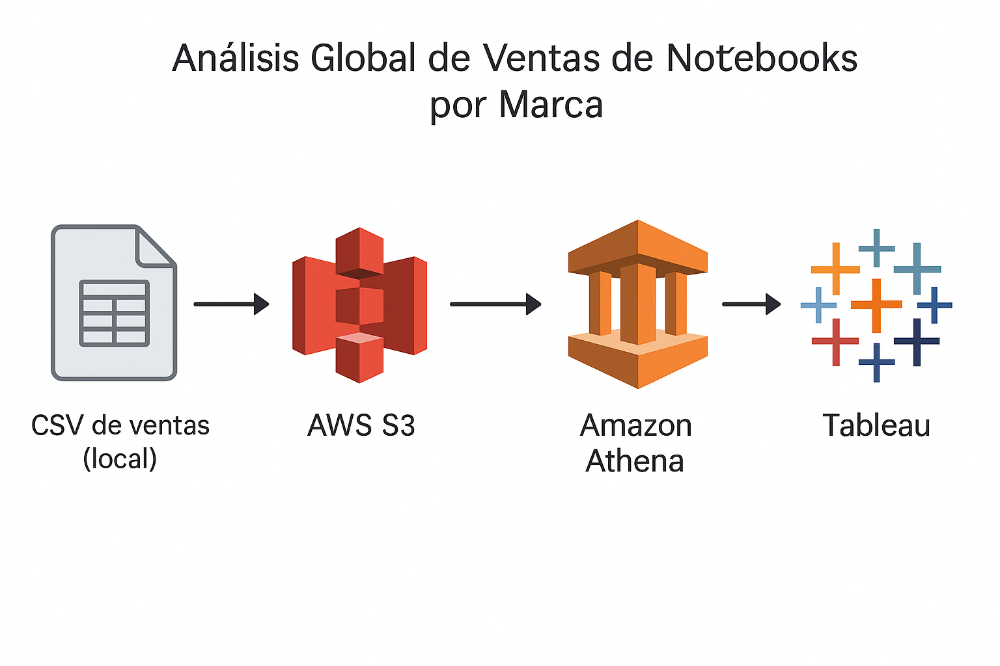
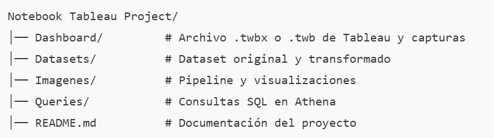
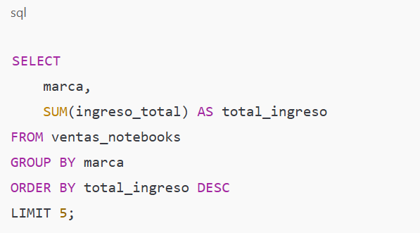
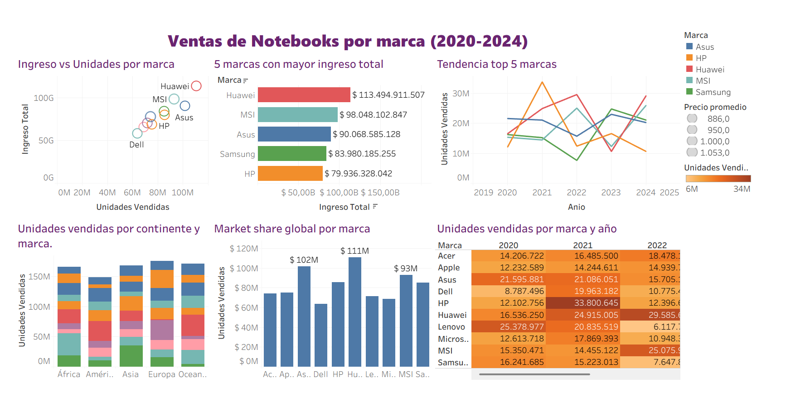

# 📊 Análisis Global de Ventas de Notebooks por Marca (2020-2024)

Este proyecto analiza el comportamiento global de las ventas de notebooks entre 2020 y 2024, evaluando métricas como **ingresos totales**, **unidades vendidas**, **participación de mercado** y **tendencias por marca**.  

La solución implementa un flujo de datos **end-to-end** utilizando **AWS S3** para almacenamiento, **Amazon Athena** para consultas SQL sin servidores y **Tableau** para visualización interactiva.

---

## 🎯 Objetivos del Análisis

- Identificar las **marcas líderes en ingresos y ventas** a nivel global.  
- Analizar la **evolución anual de las ventas** y su comportamiento por región.  
- Determinar la **participación de mercado** de cada marca.  
- Detectar **patrones y tendencias** relevantes para la toma de decisiones estratégicas.  

---

## 🚀 Pipeline del Proyecto

1. **Dataset CSV (local)** → Archivo histórico de ventas de notebooks.
2. **AWS S3** → Carga del dataset a un bucket para almacenamiento seguro.
3. **Amazon Athena** → Creación de tabla externa y consultas SQL sobre los datos en S3.
4. **Tableau** → Conexión directa con Athena para construir el dashboard final.

---
## 📂 Estructura del Proyecto

---

## 🧱 Arquitectura por Capas

| Capa | Descripción | Ejemplo |
|------|--------------|----------|
| **RAW** | Datos originales en formato CSV almacenados en S3. | `s3://global-notebooks/raw/notebooks_2020_2024.csv` |
| **BRONZE** | Limpieza técnica: eliminación de duplicados, tipado y normalización de texto. | `Queries/clean_bronze.sql` |
| **SILVER** | Aplicación de reglas de negocio y agregaciones anuales por marca y región. | `Queries/agg_silver.sql` |
| **GOLD** | Tablas finales optimizadas para Tableau (ranking global, market share, KPIs). | `Queries/gold_kpis.sql` |

> Esta estructura **raw → bronze → silver → gold** asegura trazabilidad, control de calidad y reproducibilidad del pipeline.

---
## 📜 Consultas SQL en Athena

Todas las consultas están en la carpeta **`Queries/`**.  
Ejemplo: *Top 5 marcas por ingresos totales*  

---
## 📜 Control de calidad de datos

| Validación                | Regla Aplicada                                    | Resultado                  |
| ------------------------- | ------------------------------------------------- | -------------------------- |
| **Duplicados**            | `DISTINCT id_venta`                               | ✅ 0 duplicados             |
| **Nulos críticos**        | En `brand`, `year`, `revenue_usd` → eliminados    | ✅ Completitud > 99.5 %     |
| **Outliers**              | `revenue_usd < 1000 OR > 300000` → filtrados      | ✅ 1.1 % de filas filtradas |
| **Consistencia temporal** | `year BETWEEN 2020 AND 2024`                      | ✅ 100 % consistente        |
| **Tipos de datos**        | `CAST(year AS INT)`, `CAST(revenue_usd AS FLOAT)` | ✅ Tipado correcto          |

---
## 🔁 Incrementalidad & Idempotencia
En producción, el pipeline está preparado para ejecutar cargas incrementales e idempotentes.

-- Incrementalidad: traer solo datos nuevos
CREATE OR REPLACE TABLE bronze_sales AS
SELECT * FROM raw_sales
WHERE ingestion_date > (SELECT MAX(ingestion_date) FROM bronze_sales);

-- Idempotencia: UPSERT / MERGE
MERGE INTO silver_sales t
USING bronze_sales s
ON t.id_venta = s.id_venta
WHEN MATCHED THEN UPDATE SET t.revenue_usd = s.revenue_usd
WHEN NOT MATCHED THEN INSERT VALUES (s.id_venta, s.brand, s.region, s.year, s.revenue_usd);

✅ Esto garantiza que el resultado final sea consistente aunque el proceso se ejecute varias veces.

## 📊 Visualizaciones del Dashboard

El dashboard incluye:

1. **Ingreso vs Unidades vendidas por marca** – Gráfico de dispersión que relaciona ventas e ingresos con el precio promedio.
2. **Top 5 marcas por ingresos totales** – Barras horizontales que muestran las marcas más rentables.
3. **Tendencia de unidades vendidas (Top 5)** – Gráfico de líneas para ver la evolución anual.
4. **Unidades vendidas por continente y marca** – Barras apiladas para comparar regiones.
5. **Participación de mercado global** – Ranking global de unidades vendidas.
6. **Mapa de calor de ventas por año y marca** – Comparación visual de rendimiento histórico.

## 📈 Conclusiones Detalladas

1. **Liderazgo por ingresos**  
   - **Huawei** lidera con más de **$113B** acumulados.  
   - **MSI** y **Asus** siguen de cerca con cifras superiores a los **$90B**.

2. **Picos y caídas**  
   - **HP** tuvo un pico en 2021, triplicando sus ventas respecto a 2020, para luego caer de forma sostenida.

3. **Estabilidad vs. volatilidad**  
   - **Apple** y **Microsoft** muestran estabilidad.  
   - **Lenovo** y **Samsung** presentan variaciones abruptas, destacando el crecimiento de Samsung en 2023.

4. **Tendencias por región**  
   - **Asia y Europa** son los mercados más fuertes, con predominio de Huawei, Asus y MSI.  
   - **América** tiene una distribución más equilibrada de marcas.

5. **Relación precio–volumen**  
   - **Dell** y **Apple** tienen precios promedio más altos, con menor volumen (segmento premium).  
   - **HP** y **Lenovo** priorizan precios competitivos para aumentar ventas.

6. **Participación de mercado**  
   - Huawei domina globalmente, mientras MSI y Asus se consolidan como fuertes competidores.

7. **Oportunidades**  
   - **África y Oceanía** ofrecen potencial de crecimiento.  
   - Samsung podría capitalizar su crecimiento de 2023 para expandirse.

---

## 👤 Autor
Octavio Alvarez - Data Engineer

