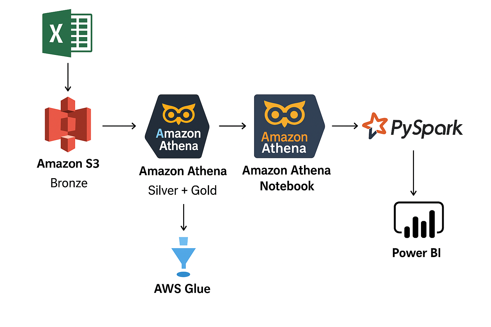
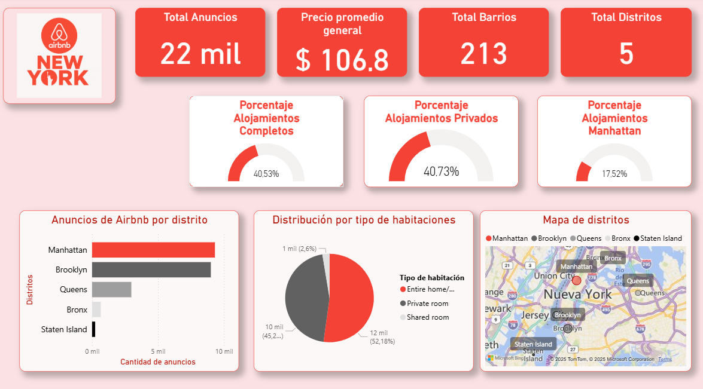

# 🏙️ Airbnb NYC Data Lake — AWS S3 + Athena + PySpark + Power BI

**Autor:** Octavio Alvarez
**Stack:** AWS S3 · AWS Glue · Amazon Athena · PySpark · Power BI
**Nivel:** Data Engineer · Data Analyst
**Dataset:** [Airbnb NYC (Kaggle)](https://www.kaggle.com/datasets/dgomonov/new-york-city-airbnb-open-data)

---

## 🧩 Descripción General

Este proyecto implementa un **pipeline de datos end-to-end** en la nube con arquitectura de capas (**Bronze → Silver → Gold**), aplicando principios de **idempotencia**, limpieza de datos y análisis exploratorio con **PySpark**, para finalmente conectar los resultados a un **dashboard interactivo en Power BI**.

La solución se ejecuta 100% en el ecosistema de **AWS**, aprovechando sus servicios serverless:

* **Amazon S3:** almacenamiento de datos crudos y procesados.
* **AWS Glue:** catálogo de metadatos para Athena.
* **Amazon Athena:** consultas SQL sobre los datos en S3.
* **PySpark (Athena Notebook):** análisis exploratorio y validación de calidad.
* **Power BI:** visualización de KPIs y métricas clave.

---

## 🏷️ Arquitectura del Pipeline



### 📚 Flujo de Datos

| Capa       | Descripción                                                | Ubicación                                   |
| ---------- | ---------------------------------------------------------- | ------------------------------------------- |
| **Bronze** | Dataset crudo cargado desde Kaggle (CSV).                  | `s3://airbnb-nyc-datalake-oalvarez/bronze/` |
| **Silver** | Datos filtrados y limpios, formato Parquet, particionados. | `s3://airbnb-nyc-datalake-oalvarez/silver/` |
| **Gold**   | Tabla agregada con KPIs listos para visualización.         | `s3://airbnb-nyc-datalake-oalvarez/gold/`   |

---

## ⚙️ ETL en Amazon Athena

El proceso ETL se realizó directamente en **Athena**, lo que permitió ejecutar SQL sobre S3 sin necesidad de infraestructura adicional.

---

### 🥜️ Capa Bronze → 🥘 Capa Silver (Limpieza e idempotencia)

```sql
-- Creación capa Silver idempotente
DROP TABLE IF EXISTS airbnb_silver;

CREATE TABLE airbnb_silver
WITH (
  format = 'PARQUET',
  external_location = 's3://airbnb-nyc-datalake-oalvarez/silver/',
  partitioned_by = ARRAY['neighbourhood_group']
) AS
SELECT DISTINCT
  id,
  name,
  host_id,
  host_name,
  neighbourhood,
  latitude,
  longitude,
  room_type,
  price,
  minimum_nights,
  number_of_reviews,
  reviews_per_month,
  calculated_host_listings_count,
  availability_365,
  neighbourhood_group
FROM airbnb_bronze
WHERE price BETWEEN 10 AND 1000
  AND number_of_reviews > 0
  AND availability_365 > 0;
```

✅ **Qué hace:**

* Filtra precios fuera de rango.
* Elimina alojamientos sin reviews o sin disponibilidad.
* Guarda el resultado optimizado en Parquet.
* Particiona por `neighbourhood_group`.
* Usa `DROP TABLE IF EXISTS` y `SELECT DISTINCT` para **idempotencia**.

---

### 🥘 Capa Silver → 🥇 Capa Gold (Agregación y KPIs)

```sql
-- Creación capa Gold idempotente
DROP TABLE IF EXISTS airbnb_gold;

CREATE TABLE airbnb_gold
WITH (
  format = 'PARQUET',
  external_location = 's3://airbnb-nyc-datalake-oalvarez/gold/'
) AS
SELECT
  neighbourhood_group,
  neighbourhood,
  room_type,
  ROUND(AVG(price), 2) AS avg_price,
  COUNT(DISTINCT id) AS total_listings,
  SUM(price * minimum_nights) AS total_income_estimate
FROM airbnb_silver
GROUP BY 1, 2, 3;
```

📊 **KPIs generados:**

* `avg_price`: precio promedio por tipo de habitación.
* `total_listings`: cantidad total de alojamientos únicos.
* `total_income_estimate`: ingreso total estimado.

🧩 **Idempotencia:**
Cada ejecución reemplaza la versión anterior, asegurando resultados consistentes y reproducibles.

---

## 🧠 Exploratory Data Analysis (EDA) — PySpark en Athena Notebook

El análisis exploratorio se realizó directamente en **Athena Notebooks** usando **PySpark**, accediendo a la tabla `airbnb_gold` registrada en **Glue Catalog**.

```python
# Cargo la tabla desde Glue Catalog
df_gold = spark.sql("SELECT * FROM airbnb_nyc_db.airbnb_gold")

print("Total de registros:", df_gold.count())
df_gold.printSchema()
df_gold.show(5)
```

### 🧹 Calidad de Datos

* Sin valores nulos ni duplicados.
* Estructura final consolidada con 6 columnas.
* Dataset preparado para análisis y visualización.

---

### 📈 Estadísticas descriptivas

```python
df_gold.describe(["avg_price", "total_listings", "total_income_estimate"]).show()
```

| Métrica                   | Media      | Mínimo | Máximo | σ       |
| ------------------------- | ---------- | ------ | ------ | ------- |
| **avg_price**             | 106.8 USD  | 13     | 800    | 70.1    |
| **total_listings**        | 45         | 1      | 954    | 114.6   |
| **total_income_estimate** | 41,983 USD | 13     | 1.3M   | 147,443 |

📊 **Conclusión:**
Alta dispersión de precios y concentración de ingresos en Manhattan y Brooklyn.

---

### 💵 Detección de Outliers (IQR)

```python
percentiles = df_gold.approxQuantile("avg_price", [0.25, 0.5, 0.75], 0.05)
q1, q2, q3 = percentiles
iqr = q3 - q1
lim_inf = q1 - 1.5 * iqr
lim_sup = q3 + 1.5 * iqr
```

🧩 **Resultados:**

* Rango típico: $55 – $235 USD
* 25 outliers detectados (principalmente en Tribeca, SoHo, Chelsea y Flatiron).
* Corresponden a alojamientos premium o de lujo.

✅ Distribución coherente con la estructura del mercado de Airbnb NYC.

---

### 🏙️ Análisis por Zona

```python
spark.sql("""
SELECT
  neighbourhood_group,
  SUM(total_listings) AS total_listings,
  ROUND(AVG(avg_price), 2) AS avg_price,
  ROUND(SUM(total_income_estimate) / SUM(total_listings), 2) AS avg_income_per_listing
FROM airbnb_nyc_db.airbnb_gold
GROUP BY neighbourhood_group
ORDER BY total_listings DESC
""").show()
```

| Zona          | Total Listings | Precio Promedio | Ingreso Promedio |
| ------------- | -------------- | --------------- | ---------------- |
| Manhattan     | 9316           | 152.6           | 1401.0           |
| Brooklyn      | 9004           | 108.0           | 688.9            |
| Queens        | 2980           | 95.9            | 369.8            |
| Bronx         | 662            | 89.9            | 285.3            |
| Staten Island | 236            | 90.2            | 286.2            |

📊 **Interpretación:**
Manhattan lidera en rentabilidad.
Brooklyn y Queens tienen la mayor oferta y volumen de propiedades activas.

---

### 🔗 Correlaciones entre variables

```python
df_corr = df_gold.select("avg_price", "total_listings", "total_income_estimate").toPandas()
df_corr.corr(method="pearson")
```

| Variable 1                             | Variable 2 | Correlación                  | Interpretación |
| -------------------------------------- | ---------- | ---------------------------- | -------------- |
| avg_price ↔ total_listings             | 0.21       | Relación débil y positiva    |                |
| avg_price ↔ total_income_estimate      | 0.36       | Correlación moderada         |                |
| total_listings ↔ total_income_estimate | 0.77       | Correlación fuerte y directa |                |

✅ **Conclusión:**
El ingreso total depende principalmente del volumen de propiedades, potenciado por los precios promedio altos en zonas premium.

---

## 📊 Dashboard en Power BI

Conexión mediante **Amazon Athena ODBC Driver**, utilizando la tabla `airbnb_gold` del Glue Catalog.



### KPIs Principales

* 💵 **Average Price**
* 🏨️ **Total Listings**
* 📍 **Neighbourhood Groups**
* 🏠 **% Entire Home/Apt**
* 🌆 **% Manhattan Properties**

### Visualizaciones

* Mapa geográfico interactivo de NYC.
* Gráfico de barras comparando distritos.
* KPI Cards con totales y promedios.
* Distribución de precios y tipos de alojamiento.

---

## 🔁 Idempotencia en el Pipeline

El flujo es **idempotente**, es decir:

> “Ejecutarlo múltiples veces produce siempre el mismo resultado.”

### Estrategias aplicadas:

* `DROP TABLE IF EXISTS` → evita duplicación de tablas.
* `SELECT DISTINCT` → elimina registros repetidos.
* `COUNT(DISTINCT id)` → evita sobrecontar alojamientos.
* **Sobrescritura controlada en S3** (sin rutas dinámicas).

✅ Garantiza consistencia, reproducibilidad y limpieza del Data Lake.

---

## 🚀 Futuras Mejoras — Orquestación con Apache Airflow

> “El pipeline actual podría automatizarse con Airflow, definiendo un DAG con tareas secuenciales para crear las capas Silver y Gold, validar la calidad de datos y refrescar el dashboard de Power BI.”

```python
# Ejemplo simplificado de DAG
from airflow import DAG
from airflow.providers.amazon.aws.operators.athena import AthenaOperator
from datetime import datetime

with DAG('airbnb_pipeline_dag', start_date=datetime(2025,10,17), schedule='@daily', catchup=False) as dag:
    silver = AthenaOperator(
        task_id='create_silver',
        query='SQL de capa Silver',
        database='airbnb_nyc_db',
        output_location='s3://airbnb-nyc-datalake-oalvarez/query-results/'
    )
    gold = AthenaOperator(
        task_id='create_gold',
        query='SQL de capa Gold',
        database='airbnb_nyc_db',
        output_location='s3://airbnb-nyc-datalake-oalvarez/query-results/'
    )
    silver >> gold
```

---

## 🦯 Conclusiones Generales

* ✅ Se construyó un **Data Lake estructurado** en AWS.
* ✅ Se aplicó **ETL completo con SQL y PySpark**.
* ✅ Se garantizó **idempotencia y calidad de datos**.
* ✅ Se integró con **Power BI** para análisis visual.
* ✅ Proyecto **escalable y apto para orquestación futura** con Airflow.

---

## 🧰 Stack Tecnológico

| Herramienta                       | Uso                                              |
| --------------------------------- | ------------------------------------------------ |
| 🩣 **Amazon S3**                  | Almacenamiento de datos crudos y transformados   |
| 🔍 **AWS Glue**                   | Catálogo de metadatos para Athena                |
| ⚙️ **Amazon Athena**              | Ejecución de ETL y creación de capas Silver/Gold |
| 🧠 **PySpark (Athena Notebooks)** | Validación, EDA y correlaciones                  |
| 📊 **Power BI**                   | Dashboard de visualización de KPIs               |
| ☁️ **(Opcional) Apache Airflow**  | Orquestación de tareas (versión futura)          |

---

## 🧾 Autor

**Octavio Alvarez**
📍 Data Engineer | Data Analyst
💻 [GitHub: OctavioAlvarez1](https://github.com/OctavioAlvarez1)
🔗 [LinkedIn: octavio-alvarez-6a229b223](https://www.linkedin.com/in/octavio-alvarez-6a229b223/)
